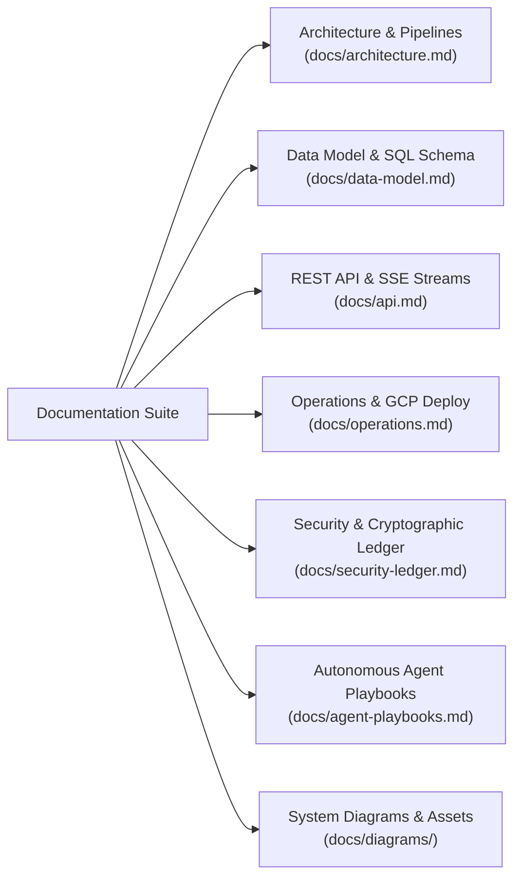

# ClearFrame Technical Documentation Suite

Welcome to the technical documentation for **ClearFrame**, an autonomous rights clearance and chain-of-title investigation platform for film and television.

---

## Documentation Navigation

---

## Core Technical Manuals

### 1. [System Architecture](architecture.md)
* **The Four Architectural Planes**: Presentation, Execution, Intelligence, and Ledger.
* **Autonomous Pipeline Stages**: Ingestion, Breakdown, Research, Adversarial Verification, Dual-Chain Tracing, E&O Assessment, Outreach, and Sentinel Monitoring.
* **Delta Re-Clearance Engine**: Cryptographic content-hashing algorithm for zero-cost revision passes.
* **Real-Time Reactive Streaming**: PostgreSQL `LISTEN`/`NOTIFY` to Server-Sent Events architecture.

### 2. [Data Model & Schema](data-model.md)
* **PostgreSQL Schema Reference**: Complete definitions for all 14 tables, enums, indices, and constraints.
* **Financial Integrity Invariant**: 64-bit integer micro-dollars (`bigint`) for all budget and spend accounting.
* **State Machine Specifications**: Finding lifecycle transitions from `queued` to counsel-gated `approved`/`licensed`.

### 3. [REST API & SSE Reference](api.md)
* **API Standards & Conventions**: Unified JSON error envelopes, tenant isolation, and RFC 3339 timestamps.
* **Endpoint Catalog**: Authentication, screenplay multipart uploads, finding triage, counsel decisions, and PDF report downloads.
* **Real-Time Event Stream**: Live SSE frame specifications (`ready`, `activity`, `finding`, `production`, `outreach`).
* **Webhooks**: HMAC-SHA256 authenticated callback verification for live web monitors.

### 4. [Operations & Deployment](operations.md)
* **Local Development**: Quickstart with Docker Compose and bare-metal Node.js.
* **GCP Cloud Run Topology**: Production deployment guidelines for API, Worker, and Web services.
* **State & Storage**: Google Cloud SQL (PostgreSQL 16) and Google Cloud Storage bucket configuration.
* **Operational Runbooks**: Diagnostic procedures for stalled jobs, broken ledger chains, and dynamic LLM pricing adjustments.

### 5. [Security & Cryptographic Ledger](security-ledger.md)
* **Cryptographic Hash Chaining**: SHA-256 block linking with canonical JSON serialization.
* **PostgreSQL Advisory Locking**: Anti-forking concurrency control for distributed background workers.
* **Database Immutability Triggers**: Row-level rules preventing unauthorized `UPDATE` or `DELETE` operations.
* **Zero-Hallucination Citation Allowlist**: In-memory retrieval pool verification dropping unverified citations.

### 6. [Autonomous Agent Playbooks](agent-playbooks.md)
* **11 Specialized Agent Roles**: Script Supervisor, 1st AD Dispatcher, Music Rights Investigator, Marks & Brands Analyst, Likeness Surveyor, Footage/Artwork Assessor, Continuity Verifier, Studio Risk Counsel, Outreach Drafter, Ledger Custodian, and Sentinel Monitor.
* **Execution Guardrails**: Industry-aligned boundaries ensuring AI never provides unauthorized legal conclusions or automated outbound communications.

---

## Architectural Diagrams

The [`diagrams/`](diagrams/) directory contains high-resolution renderings and Mermaid source files for all core system flows:

| Diagram | Description | Formats |
|---|---|---|
| **01. System Context** | High-level user, service, and provider interaction boundary | [MMD](diagrams/src/01-system-context.mmd) · [PNG](diagrams/png/01-system-context.png) |
| **02. Clearance Pass Sequence** | End-to-end execution flow from PDF upload to report signing | [MMD](diagrams/src/02-clearance-pass-sequence.mmd) · [PNG](diagrams/png/02-clearance-pass-sequence.png) |
| **03. Data Model ER** | Entity-relationship diagram for the 14 PostgreSQL tables | [MMD](diagrams/src/03-data-model-er.mmd) · [PNG](diagrams/png/03-data-model-er.png) |
| **04. Finding Lifecycle** | State machine diagram for clearance findings | [MMD](diagrams/src/04-finding-lifecycle.mmd) · [PNG](diagrams/png/04-finding-lifecycle.png) |
| **05. Delta Re-Clearance** | Cross-cut revision hashing and cache-hit decision tree | [MMD](diagrams/src/05-delta-reclearance.mmd) · [PNG](diagrams/png/05-delta-reclearance.png) |
| **06. Ledger Integrity** | Cryptographic hash chaining and append-only trigger mechanics | [MMD](diagrams/src/06-ledger-integrity.mmd) · [PNG](diagrams/png/06-ledger-integrity.png) |
| **07. Deployment Topology** | Google Cloud Run, Cloud SQL, GCS, and AI provider infrastructure | [MMD](diagrams/src/07-deployment.mmd) · [PNG](diagrams/png/07-deployment.png) |
