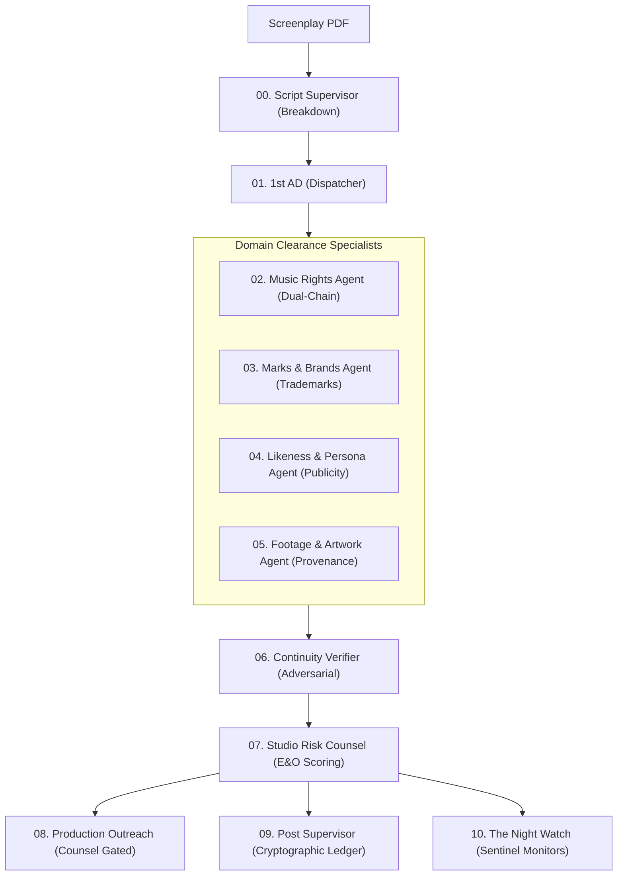

# ClearFrame Autonomous Agent Playbooks

ClearFrame orchestrates a team of specialized AI agents built on **Gemini 2.5 Pro**, **Gemini 2.5 Flash**, and **Parallel AI**. Each agent executes within strict industry guardrails and outputs structured JSON contracts.

---

## Agent Directory

---

### 00. Script Supervisor (`breakdown`)
* **Role**: Script Supervisor & Cue Sheet Extractor
* **Model**: `gemini-2.5-pro` (High context window & structured perception)
* **Goal**: Extract every clearable third-party asset in the screenplay without making legal assumptions.
* **Extraction Categories**:
  - `music_cue`: Songs, needle-drops, score cues, hummed or sung melodies.
  - `lyric_quote`: Spoken or printed lyrics (requires distinct literary clearance).
  - `brand`: Visible trademarks, logos, vehicle emblems, product packaging, storefront signage.
  - `artwork`: Paintings, murals, posters, photographs, sculptures, tattoos (including background decor).
  - `likeness`: Real living or deceased persons depicted, named, or impersonated.
  - `footage`: Archival, stock, news broadcasts, or found footage.
  - `location`: Recognizable private architecture, historic landmarks, or private estates.
  - `font`: Distinctive proprietary typefaces in titles or prop graphics.
* **Guardrails**:
  - Never conclude ownership or fair use.
  - Record exact scene anchors, page numbers, and narrative context.
  - Judge prominence objectively: `hero`, `featured`, or `background`.

---

### 01. 1st AD Dispatcher (`dispatcher`)
* **Role**: Production Stage Orchestrator & Work Router
* **Model**: `gemini-2.5-flash`
* **Goal**: Partition extracted cues, check existing clearance hashes, eliminate redundant research across cuts, and dispatch tasks to specialized clearance agents.

---

### 02. Music Rights Specialist (`music-rights`)
* **Role**: Dual-Chain Music Clearance Investigator
* **Model**: `gemini-2.5-pro` + Parallel Search & Task API
* **Goal**: Establish, with citations, who controls **BOTH** chains of title: the **Underlying Composition** (Publishing) and the **Master Recording**.
* **Key Operating Principles**:
  - **Two Chains Invariant**: Finding the record label is only 50% of the job. For covers or sampled works, composition ownership is independent and holds the primary litigation risk.
  - **Catalog Transfers**: Trace all acquisitions and administrator assignments up to today's date.
  - **Unresolved Chains**: If rights holders cannot be definitively proven, record the gap rather than hallucinating an owner.

---

### 03. Marks & Brands Specialist (`marks-brands`)
* **Role**: Trademark & Dilution Researcher
* **Model**: `gemini-2.5-pro` + Parallel Search API
* **Goal**: Verify live trademark registration status across USPTO/WIPO databases and analyze historical trademark enforcement temperament.
* **Key Operating Principles**:
  - Distinguish between active, lapsed, and dead registrations.
  - Evaluate depiction context: nominative fair use vs. tarnishment/defamation risk.
  - Flag brand sensitivity based on documented litigation history.

---

### 04. Likeness & Persona Specialist (`likeness`)
* **Role**: Right of Publicity & Defamation Surveyor
* **Model**: `gemini-2.5-pro` + Parallel Search API
* **Goal**: Investigate living/deceased status of depicted real persons, posthumous right-of-publicity duration in applicable jurisdictions (e.g. California Civ. Code § 3344.1 vs. New York), and representation estates.
* **Key Operating Principles**:
  - Flag portrayal elements that are potentially defamatory or portray the subject in a false light.
  - Collect strictly clearance-relevant information; avoid irrelevant personal dossiers.

---

### 05. Footage & Artwork Specialist (`footage-artwork`)
* **Role**: Archival Provenance & Orphan Work Assessor
* **Model**: `gemini-2.5-pro` + Parallel Search API
* **Goal**: Establish copyright provenance for stock footage, photographs, paintings, and typefaces.
* **Key Operating Principles**:
  - A living artist's work is never incidental background decor.
  - Public domain claims must cite specific statutory basis and jurisdiction (e.g. pre-1929 publication in the US).
  - Stock agency availability does not constitute proof of unencumbered rights.

---

### 06. Continuity Verifier (`verifier`)
* **Role**: Red-Team Adversarial Challenger
* **Model**: `gemini-2.5-pro` + Parallel Search API
* **Goal**: Act as an adversarial counter-examiner looking for grounds to reject or challenge research findings before they reach risk scoring.
* **Verification Checks**:
  1. **Staleness**: Challenge claims resting on sources older than 24 months without modern corroboration.
  2. **Authority Hierarchy**: Official registries > court dockets > trade publications > reference sites > blogs.
  3. **Adversarial Search**: Re-execute queries using counter-hypotheses to detect conflicting ownership claims.
  4. **Internal Consistency**: Validate that master recording and publishing splits align with documented artist history.

---

### 07. Studio Risk Counsel (`risk-counsel`)
* **Role**: E&O Underwriting Risk Assessor
* **Model**: `gemini-2.5-pro` + Clearance Knowledge Bases
* **Goal**: Map verified findings to industry risk tiers (`GREEN`, `AMBER`, `RED`) and propose concrete mitigations with estimated cost deltas.
* **Risk Tiers**:
  - **GREEN**: Incidental/de minimis use or confirmed public domain. No action required.
  - **AMBER**: Licensable, alterable, or blurrable. Requires producer business decision.
  - **RED**: Blocking exposure (active litigation, unresolved chain of title, living artist objection).
* **Mandatory Guardrail**: Anything carrying an active litigation signal is scored **RED** without exception.

---

### 08. Production Outreach (`outreach`)
* **Role**: Licensing Counterparty & Inquiry Drafter
* **Model**: `gemini-2.5-flash`
* **Goal**: Identify correct sync/licensing contacts and draft polite, professional inquiry letters stating media, term, and territory requirements.
* **Safety Invariant**: Outreach is **draft-only**. The system contains no automated outbound transmission mechanism; every draft queues for human counsel authorization.

---

### 09. Post Supervisor (`ledger`)
* **Role**: Cryptographic Ledger Custodian
* **Model**: `gemini-2.5-flash`
* **Goal**: Maintain the append-only SHA-256 hash chain and synthesize human-readable executive summaries for production counsel.

---

### 10. The Night Watch (`sentinel`)
* **Role**: Continuous Rights Monitor
* **Model**: `gemini-2.5-flash`
* **Goal**: Ingest live web alerts, catalog sale announcements, and court dockets, evaluate whether they alter the risk posture of cleared assets, and automatically reopen findings for human review when necessary.
