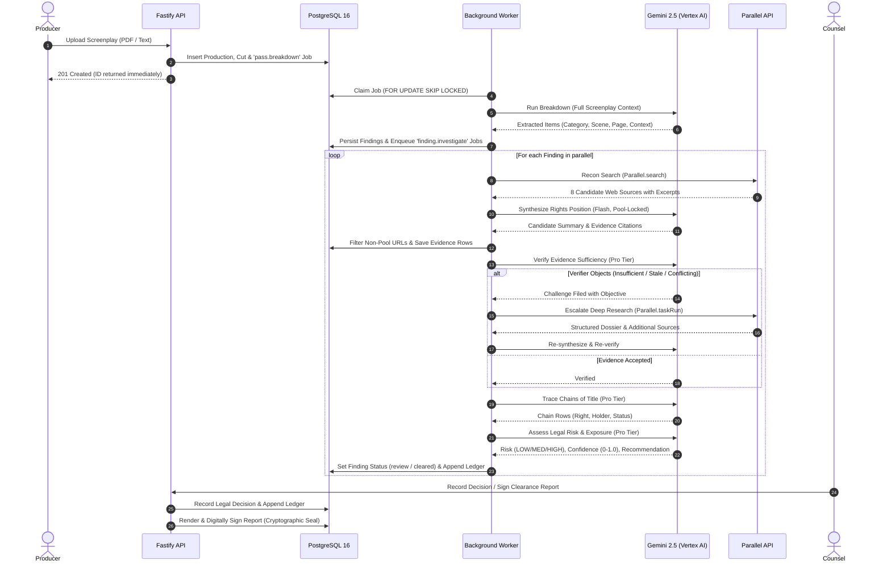

# ClearFrame Architecture

This document details the architectural design, component boundaries, execution flow, and core engineering principles of ClearFrame.

---

## 1. System Context & The Four Planes

ClearFrame is architected across four distinct planes to ensure fault tolerance, strict auditability, and clear separation of concerns.


```mermaid
flowchart TB
    subgraph EXPERIENCE["EXPERIENCE PLANE"]
        UI["React 18 Single-Page App<br/>(Vite · Vanilla CSS)"]
        SSE_CLIENT["SSE Stream Receiver<br/>(EventSource)"]
    end

    subgraph CONTROL["CONTROL PLANE"]
        API["Fastify API Server<br/>(Node.js 22 LTS)"]
        AUTH["JWT & RBAC Gate<br/>(Producer · Coordinator · Counsel)"]
        VALIDATOR["Schema Validator<br/>(Zod / Fastify)"]
    end

    subgraph EXECUTION["EXECUTION PLANE"]
        WORKER["Background Pipeline Worker<br/>(Multi-Lane Concurrency)"]
        ORCH["Pipeline Orchestrator<br/>(Multi-Stage Controller)"]
        
        subgraph PROVIDERS["AI & Retrieval Providers"]
            GEMINI["Google Vertex AI<br/>(Gemini 2.5 Pro & Flash)"]
            PARALLEL["Parallel Web API<br/>(Search & TaskRun)"]
        end
    end

    subgraph MEMORY["MEMORY PLANE"]
        PG[("Cloud SQL PostgreSQL 16<br/>(14 Tables · Append-Only Ledger)")]
        GCS["Google Cloud Storage<br/>(Screenplays · Snapshots · Signed PDFs)"]
    end

    UI -->|"REST API"| API
    SSE_CLIENT <---| "Server-Sent Events" | API
    API --> AUTH --> VALIDATOR
    VALIDATOR -->|"Enqueue Job"| PG
    
    WORKER -->|"Claim Job (SKIP LOCKED)"| PG
    WORKER --> ORCH
    ORCH -->|"Reasoning & Synthesis"| GEMINI
    ORCH -->|"Live Web Retrieval"| PARALLEL
    ORCH -->|"Append Evidence & Ledger"| PG
    ORCH -->|"Store Artifacts"| GCS

    PG -.->|"LISTEN / NOTIFY"| API
```

| Plane | Components | Guiding Architectural Invariant |
| :--- | :--- | :--- |
| **Experience Plane** | React 18 SPA, Vite, Vanilla CSS design system | Renders committed state from persisted rows. Never invents data. |
| **Control Plane** | Fastify REST API, JWT Auth, Role-Based Access Control | **Never calls an AI model directly.** Validates, enqueues work, and returns in milliseconds. |
| **Execution Plane** | Queue Workers, Pipeline Orchestrator, Gemini & Parallel adapters | Executes multi-stage reasoning and web retrieval. Owns all outbound provider spend. |
| **Memory Plane** | PostgreSQL 16 (Cloud SQL), Cloud Storage (GCS) | Immutable append-only audit trail. Micro-dollar integer accounting. |

---

### Why the API Never Calls a Model

A clearance pass on a full-length screenplay initiates dozens of multi-hop web searches, extraction calls, and LLM reasoning steps that take several minutes.

If an HTTP request held that connection open:
1. **Connection Failures**: Client timeouts, load balancer disconnects, or laptop closures kill the process mid-pass.
2. **Partial State Loss**: Crashes leave the database in an inconsistent state with no recovery mechanism.
3. **Unbounded Latency**: HTTP endpoints would block for minutes rather than milliseconds.

**The Solution:**
- `POST /api/productions` validates inputs, writes the script to GCS, inserts a `jobs` row, and returns `201 Created` immediately.
- Distributed background workers drain the `jobs` queue using PostgreSQL `FOR UPDATE SKIP LOCKED`.
- If a worker terminates, its lock expires, and the reaper releases the job for immediate resumption without re-running completed stages.

---

## 2. The Clearance Pipeline

Each element extracted from a screenplay passes through an autonomous, multi-stage reasoning pipeline:




### The Six Pipeline Stages

1. **Breakdown (`pass.breakdown`)**:
   - Analyzes screenplay structure, dialogue, action sluglines, and scene descriptions.
   - Extracts third-party elements into standard legal clearance categories: `MUSIC`, `BRAND`, `LIKENESS`, `ARTWORK`, `FOOTAGE`, `OTHER`.
2. **Reconnaissance (`recon`)**:
   - Executes broad, multi-query searches via `parallel.search` (`advanced` mode).
   - Builds an authoritative candidate pool of real web sources with extracted text snippets.
3. **Synthesis (`synthesise`)**:
   - Formulates the current legal rights position using **only** sources present in the retrieved pool.
   - Enforces the **Citation Allowlist**: any citation not matching a retrieved URL is discarded before database insertion.
4. **Verification & Challenge (`verify`)**:
   - Evaluates whether recorded evidence legally and factually supports the asserted claim.
   - If insufficient or outdated, files a structured legal objection with follow-up search objectives.
5. **Chain of Title Tracing (`traceChains`)**:
   - Traces property rights from original creation through assignments, corporate acquisitions, estate transfers, and current administration.
   - For `MUSIC`, always traces dual independent chains: **Composition** ($\copyright$) and **Master Recording** ($\text{\textcircled{P}}$).
6. **Risk Assessment (`assess`)**:
   - Computes legal risk (`LOW`, `MEDIUM`, `HIGH`) and statistical confidence score.
   - Floor constraint: Any unresolved chain or high-risk finding forces `review` and requires human counsel sign-off.

---

## 3. Strict Anti-Hallucination & Provenance

To guarantee that clearance reports withstand scrutiny by insurance underwriters and studio legal departments, ClearFrame enforces three structural integrity mechanisms:

### A. The Strict Citation Allowlist

```typescript
// Enforced in services/api/src/pipeline/stages.ts
const pool = new Map(args.sources.map((s) => [s.url, s]));
const evidence: EvidenceRow[] = [];
let dropped = 0;

for (const e of data.evidence ?? []) {
  const url = String(e?.url ?? "");
  const src = pool.get(url);
  
  if (!src) {
    dropped++; // Model generated a hallucinated or modified URL
    continue;
  }
  
  evidence.push({
    url,
    title: src.title,                // From real HTTP metadata
    domain: domainOf(url),
    stance: e.stance,
    note: String(e.note ?? "").slice(0, 300),
    publishDate: src.publishDate,    // From real HTTP metadata
    excerpt: src.excerpts.join("\n\n"),
  });
}
```

### B. Dual-Chain Music Clearance

```
                             ┌───► Master Recording (℗) ───► Record Label (Indie / Major)
"Love Will Tear Us Apart" ───┤
                             └───► Composition (©) ────────► Publishing Administrator / Estate
```

Licensing the master recording does not grant synchronization rights for the musical composition. ClearFrame evaluates both chains separately; if either chain is unresolved, the finding cannot be cleared automatically.

---

## 4. Multi-Cut Delta Re-Clearance

When a production uploads a revised script cut ($N+1$), ClearFrame avoids redundant research by computing element signatures:


1. **`item_key`** = `CATEGORY | normalize(item_name)` &rarr; Canonical element identity.
2. **`content_hash`** = `normalize(scene | page | context)` &rarr; Placement signature.

- **Unchanged Elements** (`same item_key, same content_hash`): Carried forward with existing research, chains, and decisions.
- **Modified Elements** (`same item_key, different content_hash`): Re-queued for verification to assess context shift.
- **Removed Elements** (`item_key absent from new cut`): Marked `withdrawn` in the ledger without deleting historical records.
- **New Elements**: Dispatched for full multi-stage clearance.

---

## 5. Deployment Topology


```
                                  Internet
                                     │
                         HTTPS (Cloud Run Ingress)
                                     ▼
                   ┌───────────────────────────────────┐
                   │          clearframe-web           │  (Nginx Reverse Proxy + Static SPA)
                   └─┬───────────────────────────────┬─┘
                     │ /api/                         │ /
                     ▼                               ▼
       ┌───────────────────────────┐   ┌───────────────────────────┐
       │      clearframe-api       │   │    Static React Build     │
       │    (Fastify Web Server)   │   └───────────────────────────┘
       └─────────────┬─────────────┘
                     │ Cloud SQL Connection
                     ▼
       ┌───────────────────────────┐   ┌───────────────────────────┐
       │   Cloud SQL Postgres 16   │◄──┤     clearframe-worker     │  (Queue Processor)
       │    (clearframe database)  │   │   (min-instances: 1)      │
       └───────────────────────────┘   └─────────────┬─────────────┘
                     ▲                               │ Outbound API
                     │                               ▼
       ┌─────────────┴─────────────┐   ┌───────────────────────────┐
       │     clearframe-sweep      │   │   Vertex AI & Parallel    │
       │  (Cloud Scheduler Hourly) │   │     (Reasoning & Web)     │
       └───────────────────────────┘   └───────────────────────────┘
```

ClearFrame packages both the API server and the background queue worker into a single, multi-entrypoint container image deployed across Google Cloud Run services.
