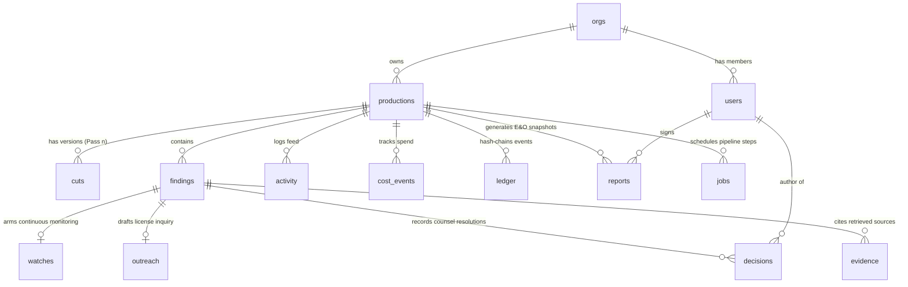
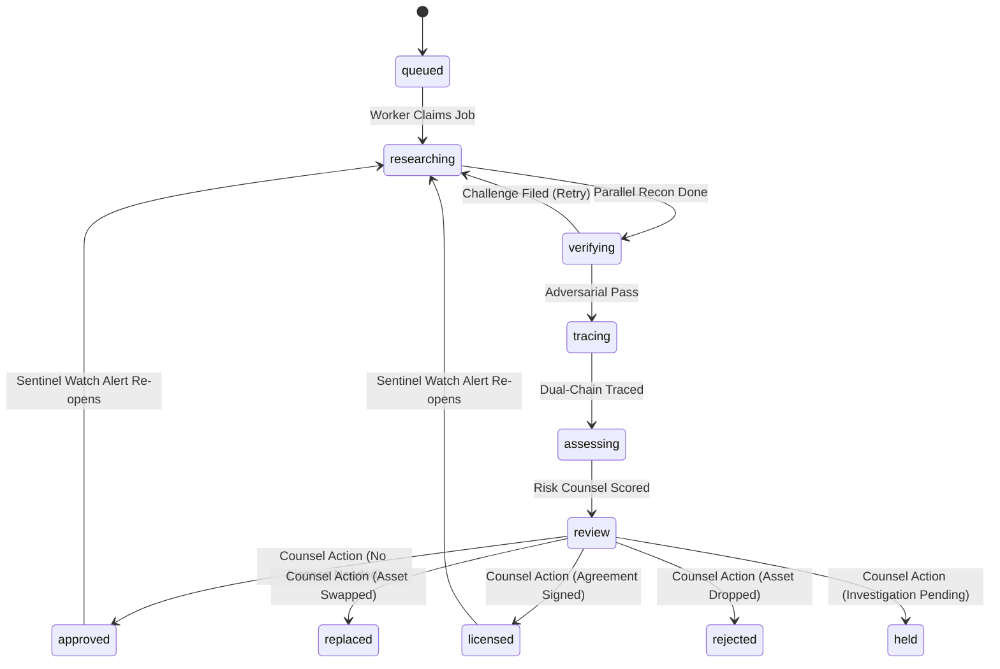

# ClearFrame Data Model & Schema Specification

ClearFrame uses PostgreSQL 16+ as its single source of truth for all pipeline state, entity relationships, financial accounting, and cryptographic audit records.

Two architectural invariants govern the entire database:
1. **Financial Integrity**: All monetary values are represented as 64-bit integer micro-dollars (`bigint`), eliminating floating-point rounding errors.
2. **Append-Only History**: Audit history and chain-of-title records are strictly immutable and protected by PostgreSQL row-level triggers and SHA-256 cryptographic chaining.

---

## Entity-Relationship Overview



---

## Schema Reference (14 Tables)

### 1. Identity & Access Control

#### `orgs`
Multi-tenant isolation root. Every user, production, finding, and spend event is partitioned by organization ID.
```sql
CREATE TABLE orgs (
  id          uuid PRIMARY KEY DEFAULT gen_random_uuid(),
  name        text NOT NULL,
  created_at  timestamptz NOT NULL DEFAULT now()
);
```

#### `users`
Authenticated participants with strict role-based access control (RBAC).
```sql
CREATE TYPE user_role AS ENUM ('producer', 'coordinator', 'counsel', 'reviewer');

CREATE TABLE users (
  id            uuid PRIMARY KEY DEFAULT gen_random_uuid(),
  org_id        uuid NOT NULL REFERENCES orgs(id) ON DELETE CASCADE,
  email         text NOT NULL,
  name          text NOT NULL,
  password_hash text NOT NULL,
  role          user_role NOT NULL DEFAULT 'producer',
  created_at    timestamptz NOT NULL DEFAULT now()
);
CREATE UNIQUE INDEX users_email_idx ON users (lower(email));
CREATE INDEX users_org_idx ON users (org_id);
```

---

### 2. Productions & Screenplay Cuts

#### `productions`
The container for a film or television project, maintaining the spend ledger and clearance lifecycle.
```sql
CREATE TYPE production_status AS ENUM
  ('draft', 'breakdown', 'running', 'review', 'complete', 'failed');

CREATE TABLE productions (
  id                uuid PRIMARY KEY DEFAULT gen_random_uuid(),
  org_id            uuid NOT NULL REFERENCES orgs(id) ON DELETE CASCADE,
  title             text NOT NULL,
  format            text NOT NULL DEFAULT 'Feature film',
  status            production_status NOT NULL DEFAULT 'draft',
  budget_cap_micros bigint NOT NULL,
  spent_micros      bigint NOT NULL DEFAULT 0,
  created_by        uuid REFERENCES users(id),
  error             text,
  created_at        timestamptz NOT NULL DEFAULT now(),
  updated_at        timestamptz NOT NULL DEFAULT now()
);
CREATE INDEX productions_org_idx ON productions (org_id, updated_at DESC);
```

#### `cuts`
Represents an individual revision or pass of a screenplay (e.g., Shooting Draft, White Revision, Blue Revision).
```sql
CREATE TABLE cuts (
  id            uuid PRIMARY KEY DEFAULT gen_random_uuid(),
  production_id uuid NOT NULL REFERENCES productions(id) ON DELETE CASCADE,
  n             int NOT NULL,                     -- Pass sequence number (Pass 1, Pass 2, etc.)
  filename      text NOT NULL,
  storage_key   text NOT NULL,                    -- GCS or local storage pointer
  mime_type     text NOT NULL,
  content_hash  text NOT NULL,                    -- SHA-256 of raw file bytes
  stats         jsonb NOT NULL DEFAULT '{}',      -- Page count, token count, cue counts
  created_at    timestamptz NOT NULL DEFAULT now(),
  UNIQUE (production_id, n)
);
```

---

### 3. Findings & Chain-of-Title Tracking

#### `findings`
The central clearance record for each third-party element discovered in the project.
```sql
CREATE TYPE finding_status AS ENUM (
  'queued', 'researching', 'verifying', 'tracing', 'assessing',
  'review', 'cleared', 'approved', 'licensed', 'replaced', 'rejected',
  'withdrawn', 'held', 'failed'
);

CREATE TYPE risk_level AS ENUM ('LOW', 'MEDIUM', 'HIGH');

CREATE TABLE findings (
  id              uuid PRIMARY KEY DEFAULT gen_random_uuid(),
  production_id   uuid NOT NULL REFERENCES productions(id) ON DELETE CASCADE,
  first_cut_id    uuid REFERENCES cuts(id),
  pass_n          int NOT NULL DEFAULT 1,
  item            text NOT NULL,                   -- Display title (e.g. "Midnight City")
  category        text NOT NULL,                   -- music_cue, brand, artwork, likeness, footage
  scene           text,                            -- Scene number or slug (e.g. "SCENE 14")
  page            text,                            -- Page reference (e.g. "p. 22")
  context         text NOT NULL DEFAULT '',        -- Narrative context / excerpt
  item_key        text NOT NULL,                   -- CATEGORY|normalised_name (Unique per production)
  content_hash    text NOT NULL,                   -- SHA-256 of (scene + page + context)
  status          finding_status NOT NULL DEFAULT 'queued',
  risk            risk_level,
  confidence      numeric(4,3),                    -- Range: 0.000 to 1.000
  summary         text,
  assessment      text,
  recommendation  text,
  verification    jsonb,                           -- Adversarial verifier report
  chains          jsonb NOT NULL DEFAULT '[]',     -- Dual chain-of-title nodes (Master & Publishing)
  tier            text,
  parallel_run_id text,
  error           text,
  stages_done     text[] NOT NULL DEFAULT '{}',    -- Checkpoint array for pipeline resume
  research_sources jsonb,                          -- Cache of verified URLs
  created_at      timestamptz NOT NULL DEFAULT now(),
  updated_at      timestamptz NOT NULL DEFAULT now(),
  UNIQUE (production_id, item_key)
);
CREATE INDEX findings_prod_idx ON findings (production_id, status);
```

#### `evidence`
Verified live-web source citations supporting a finding. Links are validated against the real retrieval pool.
```sql
CREATE TABLE evidence (
  id           uuid PRIMARY KEY DEFAULT gen_random_uuid(),
  finding_id   uuid NOT NULL REFERENCES findings(id) ON DELETE CASCADE,
  url          text NOT NULL,
  title        text,
  domain       text NOT NULL,
  stance       text NOT NULL CHECK (stance IN ('supports', 'conflicts', 'context')),
  note         text NOT NULL DEFAULT '',
  publish_date date,
  snapshot_key text,                              -- Stored copy of webpage at crawl time
  retrieved_at timestamptz NOT NULL DEFAULT now(),
  round        int NOT NULL DEFAULT 1,
  UNIQUE (finding_id, url)
);
CREATE INDEX evidence_finding_idx ON evidence (finding_id, retrieved_at);
```

#### `decisions`
Counsel resolutions that legally approve, license, replace, or reject a finding.
```sql
CREATE TABLE decisions (
  id          uuid PRIMARY KEY DEFAULT gen_random_uuid(),
  finding_id  uuid NOT NULL REFERENCES findings(id) ON DELETE CASCADE,
  action      text NOT NULL CHECK (action IN ('approved','licensed','replaced','rejected')),
  rationale   text NOT NULL DEFAULT '',
  actor_id    uuid REFERENCES users(id),
  actor_name  text NOT NULL,
  actor_role  user_role NOT NULL,
  created_at  timestamptz NOT NULL DEFAULT now()
);
```

#### `outreach`
Drafted rights-holder licensing inquiries created by autonomous agents and gated behind counsel authorization.
```sql
CREATE TABLE outreach (
  id            uuid PRIMARY KEY DEFAULT gen_random_uuid(),
  finding_id    uuid NOT NULL REFERENCES findings(id) ON DELETE CASCADE UNIQUE,
  addressed_to  text NOT NULL,
  subject       text NOT NULL,
  body          text NOT NULL,
  state         text NOT NULL DEFAULT 'draft' CHECK (state IN ('drafting','draft','approved','failed')),
  approved_by   uuid REFERENCES users(id),
  approved_name text,
  approved_at   timestamptz,
  error         text,
  created_at    timestamptz NOT NULL DEFAULT now()
);
```

---

### 4. Continuous Monitoring & Activity

#### `watches`
Monitors armed by the Sentinel agent to detect catalog acquisitions, litigation, or ownership disputes on live web endpoints.
```sql
CREATE TABLE watches (
  id                uuid PRIMARY KEY DEFAULT gen_random_uuid(),
  finding_id        uuid NOT NULL REFERENCES findings(id) ON DELETE CASCADE UNIQUE,
  provider          text NOT NULL DEFAULT 'internal',
  provider_watch_id text,
  state             text NOT NULL DEFAULT 'active' CHECK (state IN ('active','paused')),
  last_checked_at   timestamptz,
  next_check_at     timestamptz NOT NULL DEFAULT now(),
  created_at        timestamptz NOT NULL DEFAULT now()
);
CREATE INDEX watches_due_idx ON watches (next_check_at) WHERE state = 'active';
```

#### `activity`
Human-readable event feed displayed in the clearance workspace and broadcast via Server-Sent Events.
```sql
CREATE TABLE activity (
  id            bigserial PRIMARY KEY,
  production_id uuid NOT NULL REFERENCES productions(id) ON DELETE CASCADE,
  finding_id    uuid REFERENCES findings(id) ON DELETE CASCADE,
  stage         text NOT NULL,
  text          text NOT NULL,
  created_at    timestamptz NOT NULL DEFAULT now()
);
CREATE INDEX activity_prod_idx ON activity (production_id, id DESC);
```

---

### 5. Financial Metering & Job Orchestration

#### `cost_events`
Audit trail of every LLM token and web research query executed by ClearFrame.
```sql
CREATE TABLE cost_events (
  id            bigserial PRIMARY KEY,
  production_id uuid NOT NULL REFERENCES productions(id) ON DELETE CASCADE,
  finding_id    uuid REFERENCES findings(id) ON DELETE SET NULL,
  stage         text NOT NULL,
  provider      text NOT NULL,                    -- 'gemini-2.5-pro', 'gemini-2.5-flash', 'parallel'
  detail        text,
  input_tokens  int NOT NULL DEFAULT 0,
  output_tokens int NOT NULL DEFAULT 0,
  units         int NOT NULL DEFAULT 0,
  cost_micros   bigint NOT NULL DEFAULT 0,        -- 1 micro-dollar = $0.000001 USD
  created_at    timestamptz NOT NULL DEFAULT now()
);
CREATE INDEX cost_prod_idx ON cost_events (production_id);
```

#### `jobs`
Transactional worker queue executed with PostgreSQL `FOR UPDATE SKIP LOCKED`.
```sql
CREATE TABLE jobs (
  id            uuid PRIMARY KEY DEFAULT gen_random_uuid(),
  production_id uuid REFERENCES productions(id) ON DELETE CASCADE,
  kind          text NOT NULL,                    -- 'breakdown', 'investigate', 'sweep'
  payload       jsonb NOT NULL DEFAULT '{}',
  state         text NOT NULL DEFAULT 'ready' CHECK (state IN ('ready','running','done','failed')),
  attempts      int NOT NULL DEFAULT 0,
  max_attempts  int NOT NULL DEFAULT 3,
  run_at        timestamptz NOT NULL DEFAULT now(),
  locked_at     timestamptz,
  locked_by     text,
  last_error    text,
  created_at    timestamptz NOT NULL DEFAULT now()
);
CREATE INDEX jobs_claim_idx ON jobs (state, run_at) WHERE state = 'ready';
CREATE INDEX jobs_prod_idx ON jobs (production_id, state);
```

---

### 6. Cryptographic Ledger & E&O Reports

#### `ledger`
SHA-256 hash-chained immutable audit log.
```sql
CREATE TABLE ledger (
  production_id uuid NOT NULL REFERENCES productions(id) ON DELETE CASCADE,
  seq           int NOT NULL,
  ts            timestamptz NOT NULL DEFAULT now(),
  actor         text NOT NULL,
  event         jsonb NOT NULL,
  prev_hash     text NOT NULL,
  hash          text NOT NULL,
  PRIMARY KEY (production_id, seq)
);

-- Trigger: Refuse UPDATE unconditionally; refuse DELETE unless explicitly opted-in
CREATE OR REPLACE FUNCTION ledger_is_append_only() RETURNS trigger AS $$
BEGIN
  IF TG_OP = 'DELETE' AND current_setting('clearframe.allow_purge', true) = 'on' THEN
    RETURN OLD;
  END IF;
  RAISE EXCEPTION 'ledger is append-only (set clearframe.allow_purge to purge)';
END; $$ LANGUAGE plpgsql;

CREATE TRIGGER ledger_no_mutate
  BEFORE UPDATE OR DELETE ON ledger
  FOR EACH ROW EXECUTE FUNCTION ledger_is_append_only();
```

#### `reports`
Errors & Omissions (E&O) insurance clearance reports generated from a snapshot of the ledger.
```sql
CREATE TABLE reports (
  id            uuid PRIMARY KEY DEFAULT gen_random_uuid(),
  production_id uuid NOT NULL REFERENCES productions(id) ON DELETE CASCADE,
  storage_key   text,                             -- PDF asset path
  ledger_head   text NOT NULL,                    -- SHA-256 hash of latest ledger entry
  ledger_length int NOT NULL,                     -- Sequence count
  snapshot      jsonb NOT NULL,                   -- Complete finding and chain-of-title state
  signed_by     uuid REFERENCES users(id),
  signed_name   text,
  signed_role   user_role,
  signed_at     timestamptz,
  generated_at  timestamptz NOT NULL DEFAULT now()
);
CREATE INDEX reports_prod_idx ON reports (production_id, generated_at DESC);
```

---

## State Transitions & Lifecycles

### Finding State Machine


### Delta Re-Clearance Algorithm
When a new cut (Pass $N+1$) is uploaded:
1. `item_key` is calculated as `UPPER(category) + '|' + NORMALIZE(item_name)`.
2. `content_hash` is calculated as `SHA-256(scene + page + context)`.
3. If `item_key` exists in Pass $N$ and `content_hash` matches:
   - Status and clearance determinations are carried forward untouched (Cost: $0.00).
4. If `item_key` exists but `content_hash` has changed:
   - Status resets to `queued` and re-enters the pipeline for contextual re-assessment.
5. If `item_key` was present in Pass $N$ but is omitted in Pass $N+1$:
   - Status transitions to `withdrawn` (the element was cut from the film, never deleted from the ledger).
