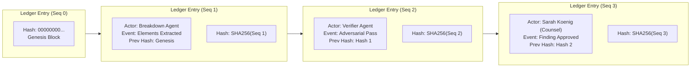

# ClearFrame Cryptographic Ledger & Security Architecture

ClearFrame provides entertainment underwriters and studio legal executives with mathematical guarantees that clearance records have not been altered, backdated, or falsified.

---

## 1. Cryptographic Ledger Design

Every clearance action, agent assessment, evidence retrieval, adversarial verification challenge, counsel resolution, and report generation event is recorded in an append-only, SHA-256 hash-chained ledger table.



---

## 2. Hash Calculation & Canonical Serialization

To guarantee deterministic hash calculation across different runtime platforms and languages, the payload for each entry is normalized using canonical JSON serialization:

1. Keys in all JSON objects are sorted alphabetically in lexicographical order.
2. Unnecessary whitespace and indentation are stripped.
3. String encoding is strictly UTF-8.

### Mathematical Hash Formula
$$\text{EntryHash}_n = \text{SHA256}(\text{production\_id} \,\|\, \text{seq}_n \,\|\, \text{ts}_n \,\|\, \text{actor}_n \,\|\, \text{canonical}(\text{event}_n) \,\|\, \text{hash}_{n-1})$$

For the genesis entry ($n = 0$), $\text{prev\_hash}$ is initialized to 64 zeroes:
```text
0000000000000000000000000000000000000000000000000000000000000000
```

---

## 3. Concurrency Protection & Anti-Forking

When multiple background workers process clearance findings in parallel, concurrent appends could lead to race conditions or split-brain chain forks.

ClearFrame eliminates this using **PostgreSQL Transaction-Level Advisory Locks**:
```typescript
// Acquire lock exclusive to this production_id
await sql`SELECT pg_advisory_xact_lock(hashtext(${productionId}))`;

// Fetch current head sequence and hash
const [head] = await sql`
  SELECT seq, hash FROM ledger 
  WHERE production_id = ${productionId} 
  ORDER BY seq DESC LIMIT 1
`;

const nextSeq = head ? head.seq + 1 : 0;
const prevHash = head ? head.hash : GENESIS_HASH;
const hash = computeSha256(productionId, nextSeq, ts, actor, event, prevHash);

// Insert next block
await sql`
  INSERT INTO ledger (production_id, seq, ts, actor, event, prev_hash, hash)
  VALUES (${productionId}, ${nextSeq}, ${ts}, ${actor}, ${event}, ${prevHash}, ${hash})
`;
```

---

## 4. PostgreSQL Append-Only Enforcement

Database-level triggers enforce that records within the `ledger` table can never be altered:
- Any `UPDATE` statement is **unconditionally rejected** with an exception.
- Any `DELETE` statement is rejected unless the transaction has explicitly set `clearframe.allow_purge = 'on'`, ensuring accidental table truncation or cascading deletions cannot destroy the chain.

```sql
CREATE OR REPLACE FUNCTION ledger_is_append_only() RETURNS trigger AS $$
BEGIN
  IF TG_OP = 'DELETE' AND current_setting('clearframe.allow_purge', true) = 'on' THEN
    RETURN OLD;
  END IF;
  RAISE EXCEPTION 'ledger is append-only (set clearframe.allow_purge to purge)';
END; $$ LANGUAGE plpgsql;

CREATE TRIGGER ledger_no_mutate
  BEFORE UPDATE OR DELETE ON ledger
  FOR EACH ROW EXECUTE FUNCTION ledger_is_append_only();
```

---

## 5. Chain Verification Algorithm

Any party—including an external insurance underwriter or distributor—can verify the mathematical integrity of a production's history using `verifyChain`:

```typescript
export async function verifyChain(productionId: string): Promise<{ valid: boolean; length: number; head?: string; brokenAt?: number }> {
  const rows = await sql`
    SELECT seq, ts, actor, event, prev_hash, hash
    FROM ledger
    WHERE production_id = ${productionId}
    ORDER BY seq ASC
  `;

  if (rows.length === 0) return { valid: true, length: 0 };

  let expectedPrev = GENESIS_HASH;

  for (const row of rows) {
    if (row.prev_hash !== expectedPrev) {
      return { valid: false, length: rows.length, brokenAt: row.seq };
    }

    const calculatedHash = computeSha256(productionId, row.seq, row.ts, row.actor, row.event, row.prev_hash);
    if (row.hash !== calculatedHash) {
      return { valid: false, length: rows.length, brokenAt: row.seq };
    }

    expectedPrev = row.hash;
  }

  return { valid: true, length: rows.length, head: expectedPrev };
}
```

If an attacker modifies a single byte in any past row, the hash recomputation will fail at that exact sequence number, identifying the tampering attempt and invalidating all downstream reports.

---

## 6. Citation Grounding & Zero Hallucination Guarantee

To prevent LLM hallucination in legal clearance reports:
1. **Live Retrieval Pool**: Every external search via Parallel AI stores the full URL and retrieved content hash in memory.
2. **Citation Allowlist Filter**: When Gemini synthesizes findings, any URL emitted by the model that does not exist in the retrieved pool is **strictly rejected** before database insertion.
3. **Rejection Logging**: Discarded hallucinated URLs are recorded in the `activity` feed to provide full visibility into model behavior.

---

## 7. Role-Based Access Control (RBAC) Matrix

| Operation | Producer | Coordinator | Counsel | Reviewer |
|---|---|---|---|---|
| Upload Screenplay Cut | ✅ | ✅ | ✅ | ❌ |
| View Findings & Evidence | ✅ | ✅ | ✅ | ✅ |
| Edit Finding Metadata | ❌ | ✅ | ✅ | ❌ |
| Approve / License Finding | ❌ | ❌ | ✅ | ❌ |
| Authorize Outreach Inquiry | ❌ | ❌ | ✅ | ❌ |
| Sign E&O Clearance Report | ❌ | ❌ | ✅ | ❌ |
| Purge Production Data | ❌ | ❌ | ❌ | ❌ (CLI Only) |
